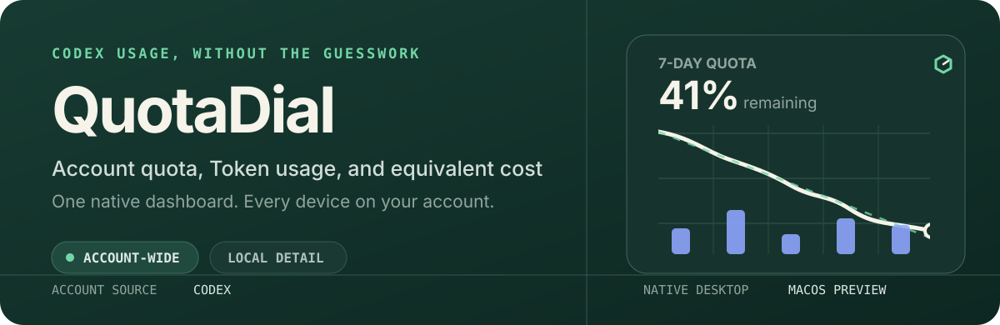
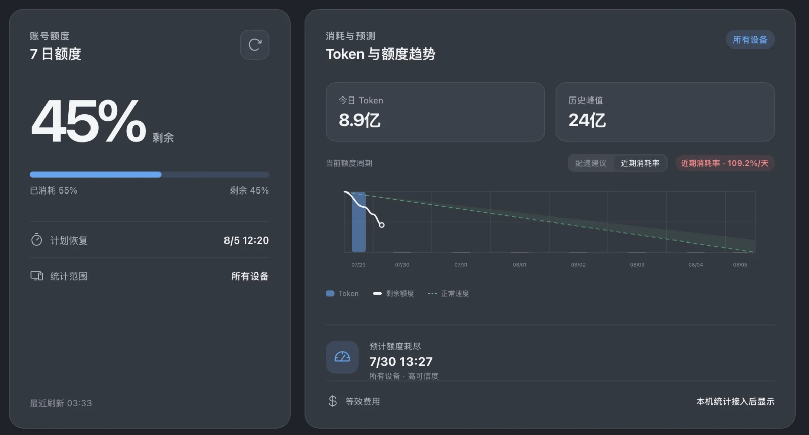

<p align="center">
  <a href="./README.md">English</a> · <a href="./README.zh-CN.md">简体中文</a>
</p>

<p align="center">
  
</p>

<p align="center">
  <a href="https://github.com/PolarisLight/QuotaDial/releases/tag/v0.1.1"></a>
  
  
  
</p>

QuotaDial is a native desktop dashboard for understanding how your Codex subscription is being used. It reads the quota reported by your signed-in account, tracks how the remaining capacity changes, and combines that account-wide view with detailed Token and cost estimates from the current computer.

<p align="center">
  
</p>

## See the limit before you hit it

- **Account-wide quota** — use the quota returned by the signed-in Codex account, including activity from other devices.
- **Consumption and forecast** — follow the downward remaining-quota curve, daily Token bars, current pace, and predicted exhaustion time.
- **Session-level detail** — inspect monthly Token usage by top-level session while rolling child-agent activity into its parent.
- **Equivalent API cost** — estimate the public API value of local usage by model, including cached input and output pricing.
- **Native menu bar and Windows quota flyout** — macOS keeps its menu-bar workflow; Windows places the remaining percentage inside the QuotaDial hex-dial tray mark and opens a compact quota panel for status and actions.

## What each number represents

| View | Source | Scope |
| --- | --- | --- |
| Quota and reset time | Signed-in Codex account | All devices using the account |
| Daily account Token usage | Codex account data | All devices when the account reports it |
| Session list and project names | Local Codex session files | Current computer only |
| Equivalent cost | Local Token records × public model prices | Estimate, not a bill |

QuotaDial keeps these boundaries explicit. It never inflates account quota from local transcript totals, and it does not present equivalent API cost as subscription spending.

## Local by design

The local session importer extracts only the data required for measurement: session relationships, model, timestamps, project path, and Token counts. Prompt text, response bodies, tool output, reasoning content, and child-agent nicknames are not written to QuotaDial's SQLite database.

## Download

[**Download QuotaDial v0.1.1 for Windows 10/11 x64 →**](https://github.com/PolarisLight/QuotaDial/releases/download/v0.1.1/QuotaDial_0.1.1_windows_x64_setup.exe)

[**Download QuotaDial v0.1.0 for Apple Silicon macOS →**](https://github.com/PolarisLight/QuotaDial/releases/download/v0.1.0/QuotaDial_0.1.0_aarch64.dmg)

This preview is not yet notarized on macOS or code-signed on Windows. macOS may require you to right-click QuotaDial and choose **Open** the first time, and Windows may show a SmartScreen warning.

## Development

Prerequisites: Node.js, pnpm, Rust, and the platform requirements for [Tauri 2](https://v2.tauri.app/start/prerequisites/).

```bash
git clone https://github.com/PolarisLight/QuotaDial.git
cd QuotaDial/app
pnpm install
pnpm tauri dev
```

Run the checks:

```bash
pnpm test
pnpm lint
pnpm build
cargo test --manifest-path src-tauri/Cargo.toml
```

On Windows, QuotaDial searches PATH, WindowsApps, the global npm directory, and Codex binaries bundled with the OpenAI extension for VS Code, VS Code Insiders, Cursor, and Windsurf. Set `QUOTADIAL_CODEX_PATH` to override detection. The tray icon displays the remaining percentage inside the product mark; either left-click or right-click opens the same compact quota flyout. The flyout consumes a lightweight in-memory snapshot instead of transferring session details. Login startup remains hidden in the tray.

See [app development notes](./app/README.md) for the data contract and local workflow.

## Roadmap

- Claude Code account-quota provider and dashboard switch
- Windows code signing and automated releases
- Apple Developer ID signing and notarization

QuotaDial is an independent utility and is not affiliated with or endorsed by OpenAI or Apple.
