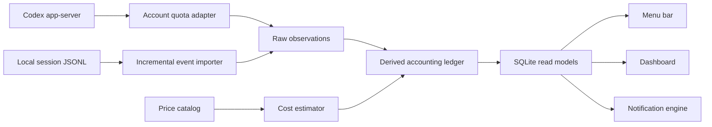

# Codex Monitor Design

Date: 2026-07-29  
Status: Approved for implementation planning  
Initial platform: macOS  
Target platforms: macOS and Windows

## 1. Purpose

Build a desktop Codex usage monitor that remains accurate when:

- Codex performs an account-wide or plan-wide quota reset.
- The same account is active on multiple computers.
- A session is forked or a subagent inherits parent history.
- Local session files are replayed, rewritten, archived, or imported again.

The application has two deliberately separate jobs:

1. Show authoritative account-level remaining quota across all devices.
2. Show locally attributable token usage and equivalent API cost by project and session.

Account quota is the source of truth for “how much quota is left.” Local logs are never
used to reconstruct cross-device remaining quota.

## 2. Scope

### Included

- A macOS menu-bar application and full dashboard.
- Direct account-level quota reads through the authenticated Codex app-server.
- Live quota updates and reset detection.
- All available rate-limit buckets, including current and future bucket identifiers.
- Reset-credit display when provided by the account API.
- Local token accounting by project, root session, child session, and model.
- Correct handling of forks, subagents, inherited context, replay, and counter resets.
- Equivalent API-cost estimates with a built-in, updateable, user-overridable price catalog.
- Configurable quota notifications, reset notifications, and data-staleness warnings.
- SQLite persistence with an immutable raw-event layer and a rebuildable derived ledger.
- Architecture that keeps platform-specific integration behind adapters for later Windows work.

### Excluded

- Monitoring Tibo or any other social-media account.
- Predicting global reset probability.
- Reading or storing message bodies for analytics.
- Claiming exact token or cost attribution for other computers that do not run a collector.
- Automating quota resets or consuming reset credits.
- Uploading telemetry to a hosted service in the first release.

## 3. Accuracy Contract

The UI must label values according to what they actually mean:

| Value | Scope | Authority |
|---|---|---|
| Remaining quota and used percentage | Account, all devices | Codex app-server |
| Scheduled reset time | Account/bucket | Codex app-server |
| Reset credits | Account | Codex app-server |
| Token and cost detail | Current device only | Local Codex event files |
| Other-device token and cost detail | Unknown in v1 | Never inferred |

The application must not convert an account percentage into a fabricated exact token count.
It may show local tokens beside account quota only when both scopes are visibly identified.

## 4. Proposed Stack

- Tauri 2 for the cross-platform desktop shell.
- Rust for app-server communication, filesystem ingestion, accounting, persistence, and tray integration.
- React and TypeScript for the dashboard.
- SQLite for durable local storage.

The application should use a new accounting core rather than importing Codex Pacer's
monotonic high-water logic. Pacer remains a useful reference for app-server and Tauri
integration, but its old ledger behavior is not part of this design.

## 5. Architecture

The account quota adapter and local importer write observations independently. A bad or
missing local import therefore cannot corrupt the account-level quota display.

## 6. Account-Level Quota

The application launches or connects to the logged-in Codex `app-server`, completes its
JSON-RPC initialization, and calls `account/rateLimits/read`.

It stores:

- `rateLimitsByLimitId` in full, without assuming a fixed number of buckets.
- Backward-compatible `rateLimits` when present.
- `usedPercent`.
- `windowDurationMins`.
- `resetsAt`.
- `planType`.
- Credit balance and reset-credit metadata.
- Observation timestamp and source health.

After initialization, it subscribes to `account/rateLimits/updated`. It also performs a
periodic read to recover from missed notifications and reads immediately after reconnect.

### Reset detection

A reset observation is derived only from account data. It is classified as:

- `scheduled_window_rollover`: reset time/window advances and usage returns downward.
- `forced_or_early_reset`: usage drops materially before the previously expected boundary.
- `bucket_reconfiguration`: bucket identity or duration changes.
- `unknown_recovery`: evidence is incomplete after a disconnect.

Each classification retains the before/after observations and reason. A falling percentage
must never produce negative usage or retroactively alter local token totals.

## 7. Local Token Import

The importer watches Codex session and archived-session directories and also performs a
bounded reconciliation scan at startup.

For every file it tracks:

- Stable path identity plus file identity where available.
- Byte offset and last observed size.
- Session ID and parent/fork relationship.
- Parser version.
- Event fingerprint.
- Import status and parse errors.

Truncation or replacement opens a new file-generation record instead of reusing an unsafe
offset. Duplicate events are ignored by stable fingerprints.

### Privacy boundary

Only structural metadata and usage numbers are persisted:

- Session ID, title, project/workspace, timestamps, model, lineage.
- Token counters and usage deltas.
- Event type and source position.

Message bodies, prompts, tool outputs, and reasoning text are neither copied to SQLite nor
sent elsewhere.

## 8. Fork, Subagent, Replay, and Reset Accounting

The importer builds a session-lineage graph before assigning usage.

Each usage-bearing event is classified as:

- `owned`: generated after the current session or child began.
- `inherited`: copied from an ancestor into a fork/subagent log.
- `replayed`: an already-known event encountered again.
- `ambiguous`: insufficient evidence; excluded from cost by default and surfaced in diagnostics.

### Ownership rules

1. `last_token_usage` is the primary per-call usage signal when present.
2. An inherited prefix that matches an ancestor is not billed to the child.
3. Matching uses normalized event fingerprints and lineage, not timestamps alone, because
   forked history may receive rewritten timestamps.
4. `total_token_usage` is a consistency check, not a blindly billable delta.
5. A decreasing cumulative counter opens a new counter epoch; it never creates a negative delta.
6. Re-importing, moving, or archiving a file cannot create new billable usage.
7. Derived assignments are versioned and rebuildable when classification improves.

These rules specifically prevent the observed failure where two subagents inherited roughly
5.6 billion parent-history tokens each and were incorrectly reported as thousands of dollars
of new usage.

## 9. Equivalent API Cost

Cost is explicitly an estimate, not the user's Codex subscription bill.

The price catalog supports:

- Model aliases and effective-date ranges.
- Input, cached-input, and output token prices.
- Built-in catalog version.
- Signed or checksummed catalog updates.
- Manual per-model overrides.
- A visible “unknown price” state instead of silently using the wrong model price.

Every computed cost record stores the price-catalog version used. Historical totals can be
viewed either at their original estimate or recalculated under the latest catalog.

## 10. Storage Model

SQLite is divided conceptually into:

### Immutable/source-oriented tables

- `account_rate_limit_observations`
- `source_files`
- `raw_usage_events`
- `session_metadata_observations`
- `price_catalog_versions`

### Rebuildable/derived tables

- `sessions`
- `session_lineage`
- `usage_assignments`
- `counter_epochs`
- `cost_estimates`
- `quota_reset_events`
- `daily_project_rollups`

### Application tables

- `notification_rules`
- `notification_deliveries`
- `app_settings`
- `migration_history`

Raw records are retained so a future parser or ownership fix can rebuild totals without
discarding user history.

## 11. User Experience

### Menu bar

The compact view shows:

- Primary quota percentage and time until scheduled recovery.
- Additional rate-limit buckets when present.
- Reset-credit count.
- Current-device tokens and equivalent cost for today.
- Last successful account refresh.

### Dashboard

The dashboard contains:

- Account quota cards, one per server-provided bucket.
- Reset/recovery timeline.
- Current-device usage charts by day, project, root session, child session, and model.
- Session lineage view that exposes inherited versus owned usage.
- Cost breakdown and active price-catalog version.
- Data-health panel for stale app-server data, parse failures, and ambiguous events.

The words “all devices” and “this device” remain visible wherever the two scopes appear
together.

## 12. Notifications

Users can configure thresholds per quota bucket. The application can notify on:

- Usage crossing a selected percentage.
- Time remaining crossing a selected duration.
- Account quota reset or recovery.
- Reset-credit availability changing.
- Account data becoming stale.
- Repeated local parsing errors.

Notifications are edge-triggered and deduplicated so polling does not repeat them.

## 13. Cross-Platform Boundary

Shared Rust crates/modules contain protocol, parsing, ledger, storage, and pricing logic.
Thin platform adapters contain:

- Codex data-directory discovery.
- Tray/menu-bar behavior.
- Startup registration.
- Native notifications.
- Secure credential handling if later required.

macOS is the release and test target for v1. Windows code paths must compile where practical,
but Windows behavior is validated later on the user's second machine.

## 14. Failure Handling

- App-server unavailable: retain the last quota value, mark it stale, and reconnect with backoff.
- Session file partially written: wait for another change and resume from the last complete line.
- Unknown schema/event: preserve raw metadata and continue importing other files.
- Database migration failure: stop writes, keep the database intact, and offer diagnostics.
- Price update failure: continue using the last valid catalog.
- Clock change: rely on server reset timestamps and monotonic process timing where appropriate.

## 15. Verification Strategy

The implementation plan must include:

- Parser fixtures for root sessions, forks, subagents, archives, truncation, and rewritten timestamps.
- Regression fixtures reproducing the two known multi-billion-token false charges.
- Property tests for non-negative deltas and idempotent re-import.
- Ledger rebuild tests across parser versions.
- Mock app-server tests for multi-bucket reads, updates, reconnects, and resets.
- SQLite migration and corruption-safety tests.
- React tests for scope labels and stale-data states.
- A macOS packaged-app smoke test.

Core invariants:

- Re-importing unchanged inputs changes no totals.
- Adding a child with only inherited history adds zero owned tokens.
- Resetting a cumulative counter does not erase prior usage or add a spike.
- Account quota remains independent of local file availability.
- Every displayed cost is traceable to usage events and a price version.

## 16. Delivery Order

1. Establish project shell and shared domain types.
2. Implement account quota adapter and live quota UI.
3. Implement raw local importer and lineage discovery.
4. Implement epoch-aware, fork-aware derived ledger.
5. Add pricing and cost estimates.
6. Add dashboard, menu bar, notifications, and diagnostics.
7. Package and validate on macOS.
8. Prepare Windows build instructions and defer device-specific tuning to the later Windows test.

